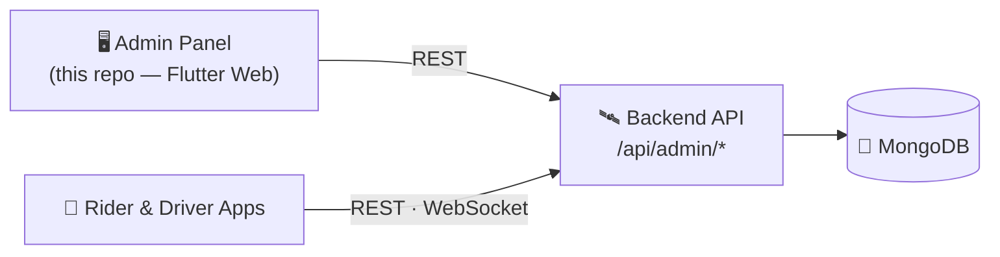

# Za2zo2a — Operator Console

Flutter **Web** admin panel for the Za2zo2a ride-hailing platform. It talks to
the same Node/TypeScript/MongoDB backend that serves the live rider and driver
mobile apps, using the admin-only endpoints under `/api/admin/*`.

Single owner/admin user, English UI, brand accent crimson `#E8194B`, light +
dark mode.

---

## 🗺️ Where it fits



Operators manage riders, drivers, trips, pricing and **driver‑document
verification** here; the same backend serves the live mobile apps.

- 🛰️ Backend → [za2zoo2a-backend](https://github.com/rota259/za2zoo2a-backend)
- 📱 Mobile apps → [Za2zo2a](https://github.com/rota259/Za2zo2a)

---

## Quick start (development)

```bash
flutter pub get

# Run in Chrome. BASE_URL points at the backend; --web-hostname=localhost
# matters (see CORS below).
flutter run -d chrome \
  --web-hostname=localhost \
  --web-port=5000 \
  --dart-define=BASE_URL=http://localhost:3000
```

Then sign in with the admin account seeded on the backend.

### ⚠️ CORS — must serve at an allowed origin
The backend's `ALLOWED_ORIGINS` (in `Za2zoo2a-main/.env`) whitelists specific
origins, e.g. `http://localhost:3000,http://localhost:5000`. The browser treats
`localhost` and `127.0.0.1` as **different origins**, so:

- Serve the app from an origin in that list (hence `--web-hostname=localhost
  --web-port=5000`).
- If you serve from elsewhere, add that exact origin to `ALLOWED_ORIGINS` and
  restart the backend — otherwise the login request is blocked by the browser
  even though the server returns 200.

### Configuring the backend URL
`BASE_URL` is compile-time (`String.fromEnvironment`), never hardcoded as a
secret. Pass it with `--dart-define=BASE_URL=...` for both `run` and `build`.
Default (if omitted) is in `lib/core/network/api_endpoints.dart`.

---

## Build for production

```bash
flutter build web --release --dart-define=BASE_URL=https://api.your-host.com
```

Output is in `build/web/` — static files you can serve from any static host or
behind Nginx. Remember to whitelist the deployed origin in the backend's
`ALLOWED_ORIGINS`.

---

## Testing

```bash
flutter analyze          # must be clean
flutter test             # unit + widget + golden tests

# Regenerate golden images after an intentional visual change:
flutter test --update-goldens
```

Golden tests render each screen (login, shell, drivers, driver detail, approval
queue, selfie review, pricing) in light and dark to `test/golden/*.png`.

> The Flutter Web preview inside some tooling keeps the document hidden, so
> CanvasKit never paints there; the golden tests are the reliable visual proof.

---

## Architecture

Feature-first **MVVM**, mirroring the mobile app's conventions:

```
lib/
  core/            theme (tokens/typography/dimens), network (dio/errors),
                   router (go_router + auth guard + page transitions),
                   services (session), widgets (button/table/badge/…)
  features/<name>/
    data/models    JSON models (tolerant parsing)
    data/repos     dio calls → typed results / ApiError
    cubit          state + logic (flutter_bloc)
    views          dumb widgets + view widgets
  injection_container.dart   get_it service locator
  main.dart
```

- **State**: `flutter_bloc` (Cubit). Views hold layout only.
- **Routing**: `go_router` with a single `redirect` auth guard; unauthenticated
  access to any route → `/login`.
- **DI**: `get_it`.
- **Network**: `dio` with a host-scoped bearer interceptor and a 401 →
  session-clear → redirect-to-login handler.
- **Auth**: JWT stored in `flutter_secure_storage`.
- **No hardcoded colours/sizes** — everything from `AppTokens`/`AppSpacing`.
- Files kept small (≈200-line ceiling), reusable widgets extracted.

---

## What's wired vs. pending

**Fully wired to real endpoints** (no mock data anywhere):

| Screen | Endpoints |
|--------|-----------|
| Login / session | `POST /api/admin/auth/login`, `GET /api/admin/auth/me` |
| Dashboard | greeting from the real admin (KPIs await a stats endpoint) |
| Drivers list + detail | `GET /api/admin/drivers`, `/drivers/:id`, `PATCH …/documents/:docType/review`, `…/approve`, `…/block` |
| Approval queue | `GET /api/admin/drivers?status=pending` + review/approve |
| Selfie review | `GET /api/admin/selfie-checks`, `PATCH …/:id/review` |
| Pricing control | `GET`/`PUT /api/admin/pricing` |
| Sidebar badges | live counts from the drivers / selfie-checks endpoints |

**Pending backend** (disabled-with-lock in the sidebar, no mock data): **Riders,
Trips, Notifications, Settings**. These have no backend endpoints yet — the exact
contract they need is specified in
[`docs/backend-admin-api-spec.md`](docs/backend-admin-api-spec.md). Once those
land, each screen is built to the same pattern (model + cubit + widgets + tests
+ golden).

Search boxes, the notification bell, "Invite driver", "Export", "Forgot
password", and the profile-menu "Account settings"/"Activity log" are rendered
per the design but intentionally **inert with an explanatory tooltip** where no
endpoint exists — never a control that silently does nothing.

## 📄 License
Released under the [MIT License](LICENSE).
